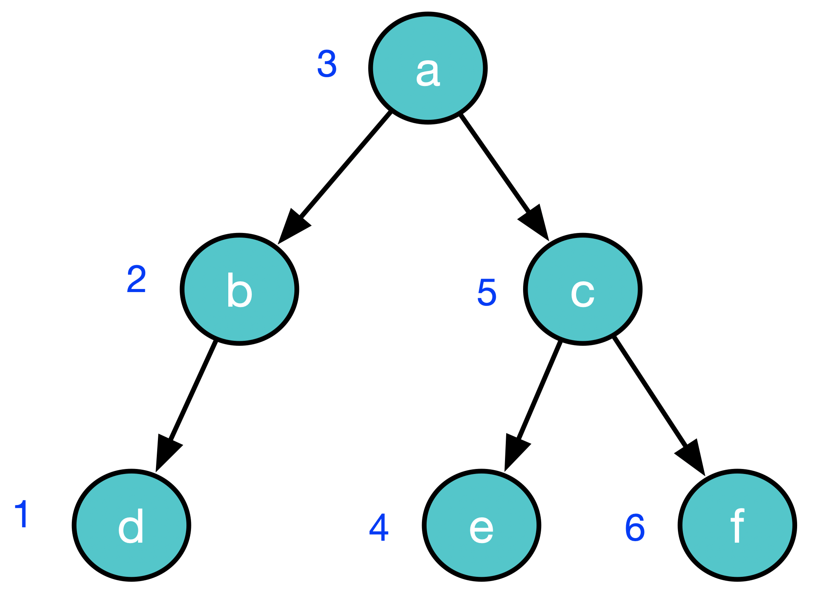

#### Who is this README written for?

I have struggled with deciding what level this introduction should be pitched at.

Should it be aimed at people who:

1. Have no experience of Functional Programming(FP)
2. Have some awareness of FP but need some tutorial material to help them understand the concepts
3. Are fairly well acquainted with FP concepts and just want know how much support this library provides for FP principles.

For now, I have decided to pitch it at the last group of people.

# Introduction

These are Java implementations of some of the data structures that you find in functional programming languages.

This means that they are **immutable** and many of the methods - especially on `ImList` are **lazy**.

It was compiled at Java 11.

There are:

* the usual FP collections like lists, maps, multimaps, sets, binary trees, queues with most of the expected functions available on them.
* A graph - a directed labelled graph that can have cycles.
* A ["rank tree"][rank-tree] that we call a shelf - a binary tree with each element indexed by its rank in the collection.
* There are lists of primitive types as well.
* Tuples - pairs, triples quarted, quintets
* Function objects that let you do partial application and "negation"
* ImMaybe, ImEither

Higher order functions are provided on collections like `map,` `fold,` `flatMap,` `filter,` `contains` (and `forEach` for that buzzy side-effect-creation feeling without the shame and guilt of using a for loop)

There are some useful classes like:

* [zippers][zipper]for most collections for navigating and "mutation" (What's that? You were expecting *Van Laarhoven lenses* - sigh - give me a break!)
* text boxes that let you format fixed width font text into blocks that span lines easily.
* text utilities on strings - like the Java ones but in an FP style
* http utilities - GETs, POSTs etc - again in the FP style
* A poor man's *value object* framework - that let's you write your objects with automated hashcode and equals and diagnostic display
* A file access utility - which wraps the standard Java classes to make them slightly FP styley. No IO Monad tho.

## Java already has **some** immutable objects

The following classses are immutable in standard Java:

    Boolean
    Character
    String
    Number
        Float
        Double
        Integer
        BigDecimal
        Long
        Short
        BigInteger
        Byte

Of these, String is the only class that could be a considered a collection of things - characters in this case.

We think that having other immutable collections is useful, too.

## The main collection classes

The main public collection classes:

 * **ImList**  - the classic functional list - maybe *slightly* similar to the Java `LinkedList`
 * **ImShelf** - the near-ish equivalent of the Java `ArrayList`
 * **ImSet** - the equivalent of the Java `Set`
 * **ImSortedSet** - the equivalent of the Java `SortedSet`
 * **ImMap** - the equivalent of the Java `Map`
 * **ImTree** - a  balanced binary tree
 * **ImRoseTree** - a tree where each node can have an arbitrary number of sub trees.
 * **ImGraph** - a classic graph - with **nodes** and **arcs** connecting the nodes
 * **ImQueue** - the equivalent of the Java `LinkedBlockingQueue`

The classes are related in a *uses* relationship. For example `ImShelf` uses an `ImTree` to store its elements. This diagram shows these *uses* relationships:

Let's describe `ImList` in some detail and then mention the other collection classes in ...er... less detail

But, before that, let's talk about our code and documentation conventions.

## Code conventions

### The class names all start with the `Im` prefix.

The `Im` stands for **Immutable**. We considered giving them simpler names like List-  without a prefix - but that causes a lot of faff with imports and confusion for the reader if you have to use both standard Java collection classes and
java-fp classes in the same method. So a pesky prefix it is, then.

### No constructors

To create any object in java-fp, we provide static methods rather than publicly accessible constructors.

### Final instance vars - no get accessors

Since all fields on all java-fp objects are declared `final,` we don't provide accessor methods for the public ones. There may be methods that calculate values that
are derived from the fields.

### Javadoc comments

We use a style that is terser than the normal convention. Argument names are mentioned in context in the description rather than separated out into their own section.

### Method names on collections can suggest mutable operation

We have names for some methods that *suggest* that they are mutating the collection - they are not of course. Methods like `add` and `put` will return new objects with
the elements added/put as indicated by method arguments - and most of the collection'e elements will be shared between the new collectioin and the old one.

We did, at one time, name the methods (eg) `adding` instead of `add` and `puttiing` instead of `put` - but this did not seem worth it after a while.

### collection indexes start at 1

Strange, but true.

### All collections are `Iterable`

For certain methods like `addAll` that simply iterate over the elements in the argument we normally type the argument to be `Iterable` so you could use an `Im` collection or a standard Java collection there.

## Documentation conventions

In the tables that follow, I am prioritizing brevity and expressivity above definitional completeness. For more details - see the javadocs.

I am showing:

* The name of the function
* An example function call
* Ahe result of running the example
* A description of what the function does

I am not showing:

* The types of the arguments
* The return types
* What exceptions get thrown

The examples are (obviously) pseudocode rather than actual Java.

For `ImList`s we are half using the standard Java `toString` convention:

Lists of Integers look like this: `[2, 4, 6]`, Booleans: `[true, false, false]`. The empty list is `[]`

We can't bring ourselves to use the ambiguous `[ a, b, c]` for `String`s and `Character`s so we use `["a, "b", "c"]` and `['a', 'b']` instead.

`ImSet`s look like this: `{1, 2, 3}`

`ImPair`s look like this `(1, "b")` `(-45.7, 22.0001)`

Where the method is `static,` it should be obvious from the example

In order to be brief in the descriptions I am using some terms that I will define here:

* For Java objects, `a`, `b,` `a` **equal-to** `b` means `Objects.equals(a, b)`. This method will ultimately call `equals` on some objects. The java default for `equals` is `==` (identity) but none of java-fp objects use this default.
* A list `a` is **equal-to** list `b` if they are the same size and each element at index `i` of `a` is equal-to the element at index `i` of `b`.
* A **prefix** of a list `xs` is one that can be formed from `xs` by removing the last `n` elements.
* A **suffix** of a list `xs` is one that can be formed from `xs` by removing the first `n` elements.
* A **sub-list** of list `xs` is a list that can be formed from `xs` by removing the first `n` elements and the last `m` elements.
* A **sub-sequence** of list `xs` is a list that can be formed from `xs` by removing some elements. `[]` is trivially a sub-sequence of all lists.
* The **head** of a non empty list `xs` is the first element of `xs.`
* The **tail** of a non empty list `xs` is the suffix of `xs` whose size is one less than the size of `xs`
* **iff** means **if and only if**.

## ImList

A (mainly) lazy implementation of a standard functional list.

As I expect you know, a functional list is a recursive data structure. An instance of a list is either
* the empty list
or
* a reference to the first element in the list (the **head**) and a reference to the list that make up the rest of the list (the **tail**).

The list ["a", "b", "c] would look like this:

This means that you can only *directly* access the first element in the list - although there are methods to let you do more than this  - and often these other methods are heavily optimised.

### The basics

| Name  | Description |
| :---  | :---        |
| **empty** | `ImList.empty()` returns `[]` - the empty list. You can also use `ImList.on()`  `ImList.empty()` returns `[]` |
| **head** | `xs.head()` returns the head of `xs`  `[1, 2, 3].head()` returns `1` |
| **tail** | `xs.tail()` returns the tail of `xs`  `[1, 2, 3].tail()` returns `[2, 3]` |
| **push** | `xs.push(el)` returns the list whose head is `el` and whose tail is `xs`  `[1, 2, 3].push(999)` returns `[999, 1, 2, 3]` |

The four methods above are the fundamental methods of `ImList.` All the other methods can be defined in terms of these - although there is a lot of optimisation going on under the hood.

### More creation

| Name  | Description |
| :---  | :---        |
| **on** | `ImList.on(e1, e2, ... en)` Creates the list `[e1, e2, ... en]`  `ImList.on("a", "b")` returns `["a", "b"]` |
| **onAll** | `ImList.onAll(iterable)` returns the list containing the elements obtained by iterating over `iterable`.  `ImList.onAll([4, 5])` returns `[4, 5]` |
| **onIterator** | `ImList.onll(iterator)` returns the list containing the elements obtained by iterating over `iterator`.  `ImList.onAll([4, 5].iterator)` returns `[4, 5]` |
| **onPrimitiveArray** | `ImList.onPrimitiveArray(array)` returns a list wrapping `array`. When using `head`, it returns the boxed type of the array component type. When using `push`, you must supply the boxed equivalent of the array component type.  `char[] chars = {'a', 'b', 'c'}; ImList<Character> cs = ImList.onPrimitiveArray(chars)` returns `[ 'a', 'b', 'c']` |

### map, fold etc

| Name  | Description |
| :---  | :---        |
| **map** | `xs.map(fn)` returns the list whose elements are created by executing the function `fn` on each element of `xs`  `[1, 2, 3].map(i -> i + 1)` returns `[2, 3, 4]` |
| **foldl** | `xs.foldl(start, fn)` returns the value that is the result of executing `fn` on start and `xs.head` and then executing `fn` on that value and the second element of `xs` and repeating this for all elemnts of `xs`  `[1, 2, 3].foldl(0, (z,i) -> z + i*i)` returns `14` |
| **scanl** | `xs.scanl(start, fn)` returns the list containing the result of running `foldl` with the same arguments at each iteration over `xs`  `[1, 2, 3].scanl([], (z, i) -> z.push(i))` returns `[[1], [2, 1], [3, 2, 1]]` |
| **flatMap** | `xs.flatMap(fn)` This function assumes that (and indeed is typed to make it so) `fn` takes an `A` and returns `ImList<A>` and is equivalent to `ImList.join(xs.map(fn))`  `[1, 2].flatMap(i -> ImList.repeat(i, 3)` returns `[1, 1, 1, 2, 2, 2, 3, 3, 3]` |
| **join** | `ImList<ImList<A>> xs = ...; ImList<A> ys = ImList.join(xs)` xs is typed to be lists of lists. The result is a single list containg the elements of each element (which is a list) in the obvious order.  `ImList.join([ [1, 2], [3, 4], [5, 6, 7] ])` returns `[1, 2, 3, 4, 5, 6, 7]` |

### contains etc

All of these functions are eager rather than lazy

| Name  | Description |
| :---  | :---        |
| **contains** | `xs.contains(el)` returns `true` iff `xs` contains an element that is equal-to `el`  `[7, 8, 9].contains(8)` returns `true` |
| **contains** | `xs.contains(pred)` returns `true` iff an element of `xs` satisfies `pred`  `[7, 8, 9].contains(i -> i > 10)` returns `false` |
| **containsAll** | `returns true iff `xs` contains all the elements of `ys``   `[7, 8, 9].contains(i -> i > 10)` returns `xs.containsAll(ys)` |
| **filter** | `xs.filter(pred)` returns the list with all the elements of `xs` that satisfy `pred` - with their order unchanged  `["to", "be", "or", "not"].filter(s -> s.length > 2)` returns `["not"]` |
| **isEmpty** | `xs.isEmpty()` returns true iff `xs` is the empty list  `[7, 8, 9].isEmpty()` returns `false` |
| **find** | `xs.find(pred)` returns the first element that satisfies `pred` in an `ImMaybe` - or `Nothing` if no such element exists  `[].find(i -> i == null` returns `Nothing` |
| **findIndex** | `xs.findIndex(el)` returns an `ImMaybe` containing the index (starting at 1) of the first element that satisfies `pred` - or `Nothing` if no such element exists  `[11, 99, 2].findIndex(i -> i%2 == 0)` returns `Just 3` |
| **findOrElse** | `xs.findOrElse(pred, def)` returns the first element of `xs` that satisfies `pred` or `def`if no such element exists  `[11, 12, 13].findOrElse(i -> i == 10, 17)` returns `17` |
| **any** | `xs.any(pred)` returns `true` iff `xs` contains any elements that satisfy `pred`  `[3, 5, 8].any(i -> i >= 8]` returns `true` |
| **all** | `xs.all(pred)` returns `true` if **all** the elements of `xs` satisfy `pred`. More acurately it is true iff `xs` does **not contain any** elements that **don't** satisfy `pred`. This means that `all` is `true` trivially for `[]`  `[3, 5, 8].all(i -> i >= 8]` returns `false` |

### take, drop etc

These methods let you extract a suffix or a prefix of a list.

| Name  | Description |
| :---  | :---        |
| **take** | `xs.take(n)` returns the list containing the first `n` elements of xs  `[1, 2, 3, 4].take(3)` returns `[1, 2, 3]` |
| **drop** | `xs.drop(n)` The list formed by skipping the first `n` elements. Note that this is not creating a new list - the resulting list simply refers to the `n`th tail of `xs`.  `[2, 3, 4].drop(3)` returns `[4]` |
| **takeWhile** | `xs.takeWhile(pred)` The longest prefix (possibly empty) of elements that satisfy `pred`  `[1, 2, 3, 4].takeWhile(i -> i < 4)` returns `[1, 2, 3]` |
| **dropwhile** | `xs.dropWhile(pred)` The lomgest prefix of `xs` formed by skipping elements that satisfy `pred`. As with `drop` above, this is not creating a new list - the resulting list simply refers to the `i`th tail of `xs` for some `i`.  `[2, 3, 4].dropWhile(i -> i < 4)` returns `[4]` |

### split - take and drop in one go

As well as the classic `take` and `drop` functions, we note that you often want to split a list into two lists - the first `n` elements and the ... um ... other elements.
The split* functions let you do this easily.

| Name  | Description |
| :---  | :---        |
| **splitBeforeElement** | `xs.splitBeforeElement(el)` returns an pair of lists - the longest prefix of `xs` that does not contain `b` and the rest of `xs`.  `["a", "b", "c", "d"].splitBeforeElement("b")` returns `(["a"], ["b", "c", "d"])` |
| **splitAfterIndex** | `xs.splitAfterIndex(n)` returns a pair of lists - `( xs.take(n), xs.drop(n) )`  `[0, 1, 1, 2].splitAt(3)` returns `( [0, 1, 1], [2] )` |
| **splitWhile** | `xs.splitWhile(pred)` returns a pair of lists - `( xs.takeWhile(pred), xs.dropWhile(Fn.not(pred) )`  `[1, 2, 3].splitWhile(i -> i < 3)` returns `[1, 2], [3])` |
| **filterIntoTwo** | `xs.filterIntoTwo(pred)` returns a pair of lists - `(xs.filter(pred, xs.filter(Fn.not(pred))`  `[1, 2, 3, 4].filterIntoTwo(i -> i % 2 == 0)` returns `([2, 4], [1, 3])` |

### "mutators" and accessors

Standard disclaimer: No objects were mutated in the making of this library

| Name  | Description |
| :---  | :---        |
| **put** | `xs.put(n, el)` returns the list that is the same as `xs` except that the element at index `n` is `el`  `[1, 2, 3].put(2, 99)` returns `[1, 99, 3]` |
| **remove** | `xs.remove(n)` returns the list that is the same as `xs` except that the element at index `n` is missing. All the elements in the suffix of `xs` starting after index `n` are shuffled to the left  `[1, 2, 3].remove(1)` returns `[2, 3]` |
| **at** | `xs.at(n)` returns an `ImMaybe` containing the element of `xs` at index `n` or `Nothing` if no such element exists  `[1, 2, 3].at(1)` returns `[2, 3]` |
| **at** | `xs.at(n, def)` returns the element of `xs` at index `n` or `def` if no such element exists  `[1, 2, 3].at(1)` returns `[2, 3]` |
| **size** | `xs.size()` returns the number of elements in `xs`. If `xs` is known to be infinite it will throw an exception - otherwise, if it was not known to be infinite but actually is, then it will loop - but it notices that it's taking a long time and will output some error messages on the standard error stream that give you a clue that it is looping.  `[].size()` returns `0` |
| **appendElement** | `xs.appendElement(el)` returns the list formed by appending the element el to the end of xs  `["bish", "bash"].appendElement("bosh")` returns `["bish", "bash", "bosh"]` |
| **append** | `xs.append(iterable)` returns the list formed from the elements of the original, followed by the elements of iterable  `[1, 2, 3].append([4, 5, 6])` returns `[1, 2, 3, 4, 5, 6]` |

### Zip-a-dee-doo-dah

Note that these zip **functions** should not be confused with `Zippers` - which I discuss below.

| Name  | Description |
| :---  | :---        |
| **zip** | `xs.zip(ys)` returns a list of pairs - `[(xs.at(1), ys.at(1)), (xs.at(2), ys.at(2)), ...  (xs.at(n), ys.at(n))]` where `n` is the size of the smaller of `xs` and `ys`  `[1, 2, 3].zip(["a", "b, "c", "d"]` returns `[(1, "a"), (2, "b"), (3, "c")]` |
| **zipWith** | `xs.zipWith(yz, fn)` returns xs.zip(ys).map(fn)  `[1, 2, 3].zip(["a", "b, "c"], p -> "" + p.fst + p.snd)` returns `["1a", "2b", "3c"]` |

### Misc

| Name  | Description |
| :---  | :---        |
| **forEach** | `xs.forEach(fn)` The function must be a `FnConsumer` - iea function that takes a single argument but does not return anything. This method iterates over `xs`, running `fn` on each element - just for the side effects. So, `forEach` is one of the few java-fp fmethods declared as `Void.`  `[1, 2, 3].forEach()` returns `[1, 2, 3]` |
| **nub** | `xs.nub()` returns a list with any duplicate elements in `xs` removed. In particular, it keeps only the first occurrence of each element.  `[2, 2, 3, 2, 3, 1].nub()` returns `[2, 3, 1]` |
| **reverse** | `xs.reverse()` returns the list that has its elements in reverse order compared to `xs`  `[1, 2, 3].reverse()` returns `[3, 2, 1]` |
| **tails** | `xs.tails()` returns the list `[ xs.drop(0), xs.drop(1), ... xs.drop(n) ]` where `n` is the size of `xs`  `[1, 2, 3].tails()` returns `[[1, 2, 3], [2, 3], [3], []]` |
| **heads** | `xs.heads()` returns the list  xs.take(0), xs.take(1), ... xs.take(n) ]` where `n` is the size of `xs`  `[1, 2, 3].heads()` returns `[[], [1], [1, 2], [1, 2, 3]]` |
| **pairs** | `xs.pairs()` returns the list `[ (xs.at(1), xs.at(2)), (xs.at(3), xs.at(4)), ...  (xs.at(n-1), xs.at(n))]` where `n` is the size of `xs`  `[1, 2, 3, 4].pairs()` returns `[(1,2), (3,4)]` |
| **powerset** | `xs.powerset()` returns all possible sub-sequences of `xs`  `1, 2, 3].powerSet()` returns `[[1, 2, 3], [1, 2], [1, 3], [1], [2, 3], [2], [3], []]` |
| **permutations** | `xs.permutations()` returns the all the permutations of `xs` (as in the mathematical definition of permutations)  `[1, 2, 3].permutations()` returns `[[1, 2, 3], [2, 1, 3], [2, 3, 1], [1, 3, 2], [3, 1, 2], [3, 2, 1]]` |
| **cartesianProduct** | `ImList.cartesianProduct(xs, ys)` The cartesian product of two sets, `A` and `B` is - the list of all pairs `(a, b)` where `a ∈ A` and `b ∈ B`. This method is similar - but will contain duplicates if either list contains duplicates.  `ImList.cartesianProduct(["a", "b"],[3, 4, 5])` returns `[("a", 3), ("a", 4), ("a", 5), ("b", 3), ("b", 4), ("b", 5)]` |
| **shuffle** | `xs.shuffle()` returns a list with the same elements as `xs` but "shuffled" (like shuffling a pack of cards) using a secure random number generator  `[1, 2, 3].shuffle()` returns `[3, 1, 2] or [1, 3, 2] or even[1, 2, 3]` |
| **repeat** | `ImList.repeat(x)` returns the infinite list `[ x, x, ... ]`  `ImList.repeat("spam").take(5)` returns `["spam", "spam", "spam", "spam", "spam"]` |
| **unfold** | `xs.unfold(start, step)` returns the infinite list `[start, fn(start), fn(fn(start)), ...]`  `ImList.unfold( 0, i -> i + 2)` returns `[0, 2, 4, ...]` |
| **toList** | `xs.toList()` returns `xs` converted to a good'ole `jave.util.ArrayList` - when you need to call some library function, for example  `[1, 2, 3].toList()` returns `java.util.ArrayList` |
| **toSet** | `xs.toSet()` returns `xs` converted to an `ImSet` and then converted to a good'ole `jave.util.HashSet`  `[1, 2, 3].toSet()` returns `java.util.HashSet` |
| **toImSet** | `xs.toImSet()` returns  `xs` converted to an `ImSet` - so the first occurence of each element will be added.  `[ 2, 3, 2, 1].toImSet()` returns `{1, 2, 3}` |
| **toArray** | `xs.toArray()` returns a Java array of type `Object[]` containing the elements in `xs`  `[1, 2, 3].toArray()` returns `[Ljava.lang.String;@768debd` |
| **group** | `xs.group(n)` returns a list of lists `gs` where `ImList.join(gs) == xs`. All the elements of `gs` have size `n` with the possible exception of the last element which might be smaller.  `[1, 2, 3].group(2)` returns `[[1, 2], [3]]` |
| **sort** | `xs.sort()` returns a list with the same elements as `xs` but sorted based on the natural ordering of the objects  `[3, 2, 1].sort()` returns `[1, 2, 3]` |
| **oneTo** | `ImList.oneTo(n)` returns a list [1, 2, ... n]  `ImList.oneTo(5)` returns `[1, 2, 3, 4, 5]` |
| **step** | `ImList.step(start, step` returns an infinite list [start, start + step,start + 2*step,  ...]  `ImList.step(1, 3)` returns `[1, 4, 7, ...]` |

Phew!

There are actually many more methods - see the javadocs.

## ImList - an interface with many implementations

`ImList` is an interface. In standard Java `java.util.List` is an interface too. However, in standard Java, it is up to you to decide what particular type of list you want to create:

    List<Integer> xs = new ArrayList<>();
    List<Integer> ys = new LinkedList<>();

In java-fp, there is no choice!

Creating an `ImList` like this:

    ImList<Double> ds = ImList.on(1.2, 3.4);

will create an "array-list" which is backed by an array but that class is never exposed to you directly. Assuming `ds` as above, the following code will "pass":

    Assert.assertEquals(ImListOnArray.class, ds.getClass());

If you map over this list then the list that is created will be a different implementation - a mapped-list.

    ImList<Double> dds = ds.map(i -> i + 1)
    Assert.assertEquals(ImMappedList.class, dds.getClass());

This is how we implement laziness. We create an `ImMappedList` that points to the original list and remembers the function that was used so that, each time you ask for the `head` or `tail`, it can generate them.

In addition to generating the head each time, we also cache it so that you can use `at`.

Currently (jul-2023) there are about thirty different `ImList` implementation classes.

The array-list implementation (what you get when you use `on`) is the most efficient and compact representation of an `ImList`. It allows for constant time access to an element at an index.

Creation of a list by supplying a number of arguments using `on` is not *lazy* - but it is *efficient* because the arguments will already be in a Java array and the array-list just wraps that array.

### Play up and play the game

`ImList` and the
other immutable collections require that you use them for storing **immutable objects only**. Strictly, the objects
don't have to be programatically guaranteed to be immutable - we just require them not to change during the
lifetime of the collection they are in.

This is the same requirement when storing objects in `java.util.Set` - we require it of **all**
of our immutable collections - including `ImList` and `ImShelf`.

Just like `java.util.Set`, we cannot enforce that rule and, if you break it, things will fail in random ways - so
it is your responsibility to "play the game" in this regard.

However, we strongly recommend that you only create immutable objects anyway - as a matter of principle.

Remember, whenever you mutate state on an object, somewhere ... **somewhere ... a fairy dies - so don't do it.**

## Don't be lazy - flush

Laziness is great an'all but sometimes, **you just want the job done right now, dammit!**.

For example, if you are debugging some code and you want to inspect a list that you have just mapped over, you really want to see the resulting **values** rather than a stack of lazy list implementations - all waiting patiently to be fired.

The `flush` method will take a list and make sure that any pending `maps`, `takes,` `drops` etc are run immediately. If any of the functions that are run in this way have side effects, then they will happen immediately, too.

To be clear, we are not advocating that any of your functions should both return values and have side effects as a standard part of their job (use `forEach` with specialised side-effect-y functions declared as `void` for this) - but
we will cut you some slack if all you want to do
is to temporarily add some diagnostic write statements. If you have some of these, you can use `flush` to control when they get actioned.

This also creates an array-list containing the resulting values.

In fact, `forEach` uses `flush` on the list before running its function on each element.

## Infinite lists

This means that you can even create a list with an *infinite* number of elements, map over it and then take the first three elements:

## Empty list is a singleton

Some of the functions on `ImList` use functions and  return objects like `ImPair`, `ImMaybe`.

Let's describe those classes next.

## ImPair, ImTriple, ImQuartet, ImQuintet

These classes are simple classes to store tuples - up to five elements long.

## ImMaybe - the equivalent of the FP Maybe.

It contains either a value of some type - or `Nothing.`

The idea is that it is returned fom functions that can sometimes return an object of a particular type - but they can't guarantee it -
instead of returning null as is traditional with Java we use `ImMaybe.`

[The Haskell Maybe documentation](https://hackage.haskell.org/package/base-4.18.0.0/docs/Data-Maybe.html#t:Maybe)

## ImEither - the equivalent of the FP Either.

The `ImEither` object represents values with two possibilities: a value of type `Either<A,B>` contains either an `A` value created using `Left` or a `B` value - created using `Right`.

The `ImEither` object is sometimes used to represent a value which is either correct or an error;
by convention, the `Left` "constructor" is used to hold an error value and the `Right` "constructor" is used to hold a correct value (mnemonic: "right" also means "correct").

[The Haskell Either documentation](https://hackage.haskell.org/package/base-4.18.0.0/docs/Data-Either.html#t:Either)

Having discussed `ImList` in some detail, we can go through the other collection classes a bit more ... fasterer

## ImShelf - the near-ish equivalent of the Java `ArrayList`

An ordered list of objects with addition, removal and access methods having performance O(log n) where n is the number of elements

You could also think of this as an immutable version of `org.apache.commons.collections.list.TreeList`

This is the nearest equivalent to java.util.List in the sense that add/find/remove/replace is relatively fast in all cases.

In fact, when an `ImList` happens to be implemented by the array-list class, these operations are already fast - faster than ImShelf - but as you use lists and map them and push elements etc
you can't guarantee that the lists returned will be array-lists - and in these other list implementaions, the above functions  may not be so fast.

The idea of the name
is that, if you have a collection of books on a bookshelf, then
the books are arranged in a sequence and it is reasonably quick
to add/find/replace/remove a book at an arbitrary position.

## ImSet - the (immutable) equivalent of the standard Java `Set`

So, an `ImSet` is a collection of objects with the property that, if an object `o` belongs to the set then, for any other member `a` of the set:

    a.equals(o) == false

We therefore assume that the objects in the set have "reasonable" implementations of `hashCode()` and `equals()`

A web search for the phrase `always override hashCode when you override equals` will provide more details of the issues involved.

All classes in java-fp have this property, of course.

In the class documentation for `java.util.Set` it has this:

> Note: Great care must be exercised if mutable objects are used as set
> elements.  The behavior of a set is not specified if the value of an object
> is changed in a manner that affects `equals` comparisons while the
> object is an element in the set.

Well, there we have it. This obviously also applies to `ImSet.` I recommend we exercise **great care** by **never** adding a mutable object to an `ImSet`

All classes in java-fp are immutable - as I may have already menetioined.

`ImSets` cannot contain `null` .

When we use set data structures in any progremaming language, it is tempting to imagine that they are are implementaions of the mathematical concept of a set.
This is not quite true, of course. In mathematical set theory we assume that it is possible to answer the question "is a the sams as b" when thinking about set elements a and b.

In Java we only have equals method (or == I guess) - so, using equals, it is possible for us to have an element a in a set and then we try to add another element b where

    Objects.equals(a,b) == true

but, for whatever reason, we want to regard b as different from a.

What should we do in this case?

The java class `java.util.HashSet` will keep `a` in the set in this case.

java-fp, like the Haskell `Data.Set` type, gives you the option of replacing `a` in this case. See below for details.

Also, we, like most set implementations in other languages and libraries, only support **finite** sets.

`ImSet`s have the methods that you would expect:

| Name  | Description |
| :---  | :---        |
| **contains** | `xs.contains(el)` returns `true` iff `xs` contains `el`.  `{1, 2, 3}.contains(3)` returns `true` |
| **on** | `ImSet.on(e1, e1, ... en)` returns an ImSet with elements e1 e2 etc added to it  `ImSet.on(1, 2, 1)` returns `{1, 2}` |
| **intersection** | `xs.intersection(ys)` returns the intersection of xs and ys - the largest set such that each element belongs to both xs and ys  `{1, 2}.intersection({3, 2, 77)}` returns `{2}` |
| **union** | `xs.union(ys)` returns the union of xs and ys - the largest set such that each element belongs to either xs or ys  `{1, 2}.union({3, 2, 77)}` returns `{1, 2, 3, 77}` |
| **minus** | `xs.minus(ys)` returns the xs minus ys - the largest set such that each element belongs to xs but not to ys  `{1, 2}.minus({3, 2, 77)}` returns `{1, 2, 3, 77}` |
| **remove(final T elementToRemove)** | `xs.minus(ys)` returns the xs minus ys - the largest set such that each element belongs to xs but not to ys  `{1, 2}.minus({3, 2, 77)}` returns `{1, 2, 3, 77}` |
| **replace(final T newElement)** | `xs.minus(ys)` returns the xs minus ys - the largest set such that each element belongs to xs but not to ys  `{1, 2}.minus({3, 2, 77)}` returns `{1, 2, 3, 77}` |
| **add(final T elementToAdd)** | `xs.minus(ys)` returns the xs minus ys - the largest set such that each element belongs to xs but not to ys  `{1, 2}.minus({3, 2, 77)}` returns `{1, 2, 3, 77}` |
| **map** | `xs.map(fn)` returns the set  `{1, 2}.map(i -> i - 1}` returns `{0, 1}` |
| **anyElement()** | `xs.anyElement()` returns an element from xs in an ImMaybe, or Nothing if nosuch element exists  `{1, 2, 17}.anyElement()` returns `17 or 1 or 2` |

Methods that find/add/replace elements are **O(log(n))** where `n` is the size of the set and `log` is base `2`.

Sometimes it is convenient to be able to add an element to a set even though that set already contains an element that is "equal to it".

For example `ImMap` is implemented as a set of `ImMap.Entry` objects where an entry has a key and a value. Two `ImMap.Entry` objects are equal iff their keys are equal. So for any pair of entries `e1` and `e2` :

    e1.equals(e2) == e1.key.equals(e2.key)

When we want to replace an entry, we want the new entry with its new value to be inserted in the set, even though there is an existing entry with the same key.

To allow this, there are methods `replace` and `add`. The default behaviour when using `add`  is to *not* replace

An ImSet is a sorted set of buckets where elements whose hash codes are the same are stored in the same bucket.

Buckets are sorted on the hash value of their elements.

To find an element, we first find the bucket with the matching hash value and then look through the bucket to determine if the element is present.

For sets of elements with reasonable hash functions, the average bucket size will be one.

## ImSortedSet - the equivalent of the Java `java.util.TreeSet`

A Set that contains elements that are comparable.

In summary - on an `ImSortedSet<T>`:

## Creation

static <T extends Comparable<? super T>> ImSortedSet<T> empty()
static <T extends Comparable<T>> ImSortedSet<T> on(T element)
static <T extends Comparable<T>> ImSortedSet<T> onAll(Collection<? extends A> elementsCollection)
static <T extends Comparable<T>> ImSortedSet<T> onAll(ImList<T> list)
static <T extends Comparable<T>> ImSortedSet<T> onArray(final A... array)
static <T extends Comparable<T>> ImSortedSet<T> onIterator(Iterator<T> iterator)

## Accessing

static <T extends Comparable<? super T>> ImTree<A> find(ImTree<A> tree, final T elementToFind)

## "Mutation"

ImSortedSet<T> add(final T elementToAdd)
ImSortedSet<T> addAll(Iterable<? extends T> elementsToAdd)
ImSortedSet<T> remove(final T elementToRemove)

## Map
<O extends Comparable<O>> ImSortedSet<O> map(Fn<T, O> fn)

## Querying

T find(final T elementToFind)
boolean contains(Object object)
int size()

## ImMap - the equivalent of the Java `Map`

An immutable version of `java.util.Map`.

A collection (actually an ImSet) of `Entry` objects which are key/value pairs.

As with `java.util.Map`, the fundamental methods are `get` `put` and `remove` although `put` and `remove` have a different meaning since `ImMaps` are immutable.

Instead of modifying the map in place, `put` creates a new map containing the new key value pair and `remove` creates a new map that ... doesn't contain it.

Let's describe some typical usages.

Create an empty map:

    ImMap<String, String> mEmpty = new ImMap<String, String>();
    mEmpty.isEmpty()  =>  true

Put an entry:

    ImMap<String, String> mOne = mEmpty.put("a", "Aardvark");

public static <A, B> ImMap<A, B> fromPairs(ImList<Pair<A, B>> pairs)

The new map will have the entry

    mOne.size()    =>  1
    mOne.get("a")  =>  "Aardvark"

But the old one will be unchanged:

    mEmpty.isEmpty()  => true

Put another entry

    ImMap<String, String> mTwo = mOne.put("b", "Bear");

The new map, `mTwo` has two entries:

    mTwo.get("a")  => "Aardvark"
    mTwo.get("b")  => "Bear"

And, of course, `mOne` has not changed:

    mOne.size()    =>  1
    mOne.get("a")  =>  "Aardvark"
    mOne.get("b")  =>  null

You can remove entries:

    ImMap<String, String> mThree = mTwo.remove("a");
    mThree.get("a")  => null

If you remove them when they weren't there:

    ImMap<String, String> mFive = mTwo.remove("z");

The new map is the same as the old one:

    mFive == mTwo  =>  true

You can replace entries:

    ImMap<String, String> mFour = mTwo.put("b", "Buffalo");
    mFour.get("b")  =>  "Buffalo"

If you replace entries with identical ones then no new map is created - the old one is returned:

    ImMap<String, String> mSix = mTwo.put("b", "Bear");
    mSix == mTwo  =>  true

If you replace entries with *equal* but non identical entries then you get a new map:

    ImMap<String, String> mSeven = mTwo.put("b", "Bear".substring(1));
    mSeven == mTwo  =>  false

You can create an `ImMap` from a list of pairs or keys/values:

     ImList<Integer> is = Range.step(11, 11).take(9);

     // [11, 22, 33, 44, 55, 66, 77, 88, 99]

     ImList<String> words = is.map(i -> TextUtils.toWord(i));

     // [eleven, twenty two, thirty three, forty four, fifty five, sixty six, seventy seven, eighty eight, ninety nine]

     ImMap<String, Integer> wordsToIntegers = ImMap.fromPairs(words.zip(is));

     say(wordsToIntegers.get("ninety nine"));

     // 99

## ImTree - an immutable balanced binary tree

This class is the heart of a number of collections.

An `ImTree` is an **AVL tree** (a balanced binary tree) where each node stores some arbitrary data.

### An important note about this class - no ordering of elements is required or used

Note that, in this class, there is no concept of the data that is being stored being `Comparable`.

This may be surprising to you since most of the literature and implementations of this data structure assume that the elements to be stored **can** be compared - ie that there is a **total order** on the elements
(maybe this
should  be a total preorder - but let's simplify this discussion and stick to a total order for now)

Usually, It is by using this property that we can find where an element:

* is in the tree
* should be in the tree if we added it

We do this by starting at the root and then checking if the element stored at this node is the one we are looking for. If not we use the ordering of the elements to decide if we need
to search the **left** subtree or the **right** subtree.

A key observation, here, is that the ordering is not the only way of deciding which subtree to search if an element is not in a node.

For example, in a **Rank Tree** (which is what `ImShelf` is) we can use the size of each tree to make this decision. Of course, this requires us to store the size of each subtree.

When we do operations on the tree like deleting or adding an element, all the algorithms to keep the tree balanced by doing tree rotations etc do not need the elements to be ordered.

Because we wanted to use AVL trees to store ordered elements and no-ordered elements we decided to have this class implement juat the insertion and deletion algorithms.

`ImSortedSet` and `ImShelf` both use this class and they add their own find methods as appropriate. `ImSortedSet` does require its elements to have an ordering and `ImShelf` does not.

### More details

A node in an `ImTree` is either a leaf node `Nil` or a `Node` that has two children that are themselves `ImTrees` .

Each `Node` can contain a value of an arbitrary type and two Integers representing the height and size of the tree rooted at that node. A `Nil` has no data.

Note that this definition does not, of itself, specify that the tree is balanced. We enforce that invariant in each method that adds/removes nodes.

Consider an example tree with six non nil nodes:

If we show the nil nodes then it looks like this:

Each node also has a `size` value defined as the sum of the sizes of its children plus one. Nil Nodes are considered to have a size of zero. The size of a node, `n`, represents how many non-nil nodes there are in the tree rooted at `n`.

Each node also has a `height` value representing the size of the longest path from that node to a leaf node.

The height of a node is the maximum of the heights of its children. Nil nodes are considered to have a height of zero.

Let's annotate our example with the heights:

Because the tree is balanced, this means that the heights of the children of a node will differ by at most one.

Each node is considered to have a *rank* that represents its position in the tree in a pre-order scan.

Ranks start at one (exactly as Nature intended!)

Let's annotate our example with the ranks:

We don't store the ranks. To calculate the rank of a node or to find a node at a particular rank we can use the size of child nodes to derive the answer.

These are **immutable** Collections so the `insert` and `remove` methods don't actually change existing trees. Instead they create a new tree with a node added or deleted as appropriate, reusing as many of the old nodes as possible.

[Implementing Sets Efficiently in a Functional Language,Stephen Adams](http://groups.csail.mit.edu/mac/users/adams/BB/92-10.ps )

In summary - on an `ImTree<A>`:

## Creation

* `static <A> ImTree<A> Nil()`
* `static <A> ImTree<A> on(A a)`
* `static <A> ImTree<A> on(Collection<A> elements)`

## Accessing

* `A getElement()`
* `ImTree<A> getLeft()`
* `ImTree<A> getNodeAtIndex(int indexStartingAtOne)`
* `ImTree<A> getRight()`

"Mutation"

* `static <A> ImTree<A> replaceAtIndex(ImTree<A> tree, int indexStartingAtOne, A newElement)`
* `ImTree<A> insert(int indexStartingAtOne, A elementToAdd)`
* `ImTree<A> remove(int indexStartingAtOne)`
* `ImTree<A> removeRoot()`

## Map

* `<O> ImTree<O> map(Fn<A, O> fn)`

## Tree operations

* `static <A> ImTree<A> merge(ImTree<A> left, ImTree<A> right)`
* `static <A> ImTree<A> newBalancedTree(A newA, ImTree<A> newLeft, ImTree<A> newRight)`

## Querying

* `boolean isBalanced()`
* `int getHeight()`
* `int getRank()`
* `int size()`

## Display

* `String elementToString()`
* `String toBoxString()`
* `String toString()`

## Conversion

* `ImList<A> toList()`

## ImRoseTree - a tree where each node can have an arbitrary number of sub trees.

An immutable version of a Rose Tree (Multi-way Tree) - a tree in which each node has a *value* and an arbitrary number of *sub-trees*.

Note that rose trees are not the same as B-Trees.

A rose tree has a root node containing an element and an ordered list  of sub-trees. The definition is recursive - each sub-tree also has an element and a list of sub-trees and so on. Leaf trees are those with no sub-trees - ie the list is empty.

For example, the tree with element `a` and three children:

The leaf node `b`

The tree with element `c` that has three children that are leaf nodes `e` , `f` , `g`

The tree with element `d` that has a single child - the leaf node `h`

In the above diagram, `a` is said to be the parent of children `b`, `c` and `d`

We could also represent it like this:

or like this:

    a
    .........
    b c     d
      ..... .
      e f g h

This text representation is an example of what `toBoxString` produces.

Some creation methods:

| Name  | Description |
| :---  | :---        |
| **withElements** | `ImRoseTree.withElements(parentElement, childElements)` assuming childElements is a list, a rose tree that is one parent with element `parentElement` and children that are leaf nodes. Each child of index `i` has an element that is index `i` of `childElements`  `` returns `` |
| **withNodes** | `ImRoseTree.witNodes(parentElement, childNodes)` assuming childNodes is a list, a rose tree that is one parent with element `parentElement` and children where each child of index `i` has an element that is index `i` of `childNodes.`  `` returns `` |

Both the above methods also have versions where the list is indicated by `varArgs`.

In summary - on an `ImRoseTree<A>`:

### Creation

* `withElements(A, A...)`
* `withElements(A, ImList)`
* `withNodes(A, ImRoseTree...)`
* `withNodes(A, ImList)`

## Query

* `contains(A)`
* `getElement()`
* `getSubTrees()`
* `getNodeAtIndex(int)`
* `size()`

## "Mutation"

* `replaceElement(A)`
* `map(Fn)`
* `Iteration`
* `iterator()`
* `getZipper()`
* `getZipperIterator()`

## Display

* `toString()`
* `toBoxString()`

## Notes

We store the children of a node in an `ImList`

In this library our convention is to call a **binary** tree a **Tree** and a **multi-way** tree a **Rose Tree**.

## ImGraph - a classic graph - with nodes and arcs connecting the nodes

A directed, labelled graph. It can have cycles.

Not all the nodes need to be connected.

Nodes are identified by keys of type `KEY`
Each node has an object of type `DATA` associated with it

Each node can be connected to 1 or more other nodes via labelled arcs. Arcs have a direction.

Many arcs can have the same label

Graphs are immutable - each time you add a node or an arc between two nodes, a new graph is created.

The `show` method returns a text representation of the graph in the form of an ascii art diagram.

Here is an example of a graph with arcs labelled `art` or `mod` and its ascii-art diagram:

In summary, for an `ImGraph<KEY, DATA, LABEL>`:

## Creation

* `static <KEY, DATA, LABEL> ImGraph<KEY, DATA, LABEL> empty()`

## Accessing

* `ImList<DATA> getValuesFromKeys(ImList<KEY> keys)`
* `ImList<ImList<KEY>> getPaths(Dir dir, ImSet<LABEL> labels, KEY key)`
* `ImList<ImPair<LABEL, KEY>> getPairs(Dir dir, KEY key)`
* `ImList<KEY> getClosure(Dir dir, ImSet<LABEL> labels, KEY key)`
* `ImList<KEY> getClosure(Dir dir, KEY key)`
* `ImList<KEY> getClosure(Dir dir, LABEL label, KEY key)`
* `ImList<KEY> getConnected(Dir dir, ImSet<LABEL> labels, KEY key)`
* `ImList<KEY> getConnected(Dir dir, KEY key)`
* `ImList<KEY> getConnected(Dir dir, LABEL label, KEY key)`
* `ImList<KEY> getInOrderClosure(Dir dir, ImSet<LABEL> labels, ImList<KEY> keys)`
* `ImList<KEY> getInOrderClosureOnSingleKey(Dir dir, ImSet<LABEL> labels, KEY key)`
* `ImList<KEY> getInclusiveClosure(Dir dir, LABEL label, ImList<KEY> keys)`
* `ImList<KEY> keys()`
* `ImList<KEY> leaves()`
* `ImList<KEY> roots()`
* `DATA getValue(KEY key)`

## "Mutation"

* `ImGraph<KEY, DATA, LABEL> addArc(LABEL label, KEY start, KEY end)`
* `ImGraph<KEY, DATA, LABEL> addArcAfter(LABEL label, KEY start, KEY end, KEY after)`
* `ImGraph<KEY, DATA, LABEL> addArcAsLast(LABEL label, KEY start, KEY end)`
* `ImGraph<KEY, DATA, LABEL> addNode(KEY key, DATA value)`
* `ImGraph<KEY, DATA, LABEL> addNodeIfMissing(KEY key, DATA value)`
* `ImGraph<KEY, DATA, LABEL> addNodeToParent(LABEL arcLabel, KEY parentKey, KEY childKey, DATA childValue)`
* `ImGraph<KEY, DATA, LABEL> removeArc(LABEL label, KEY start, KEY end)`
* `ImGraph<KEY, DATA, LABEL> removeNode(KEY key)`
* `ImGraph<KEY, DATA, LABEL> shrinkToInclusiveClosureOf(ImSet<LABEL> labels, ImList<KEY> ks)`

## Map

* `<NEWDATA> ImGraph<KEY, NEWDATA, LABEL> map(Fn<DATA, NEWDATA> fn)`

## Queries

* `boolean containsNodeWithKey(KEY key)`
* `boolean hasCycle()`

## Display

* `String getGraphVizGraph()`
* `AbstractTextBox show()`

## ImQueue - a FIFO queue - similar to `java.util.LinkedBlockingQueue`

| Name  | Description |
| :---  | :---        |
| **on** | `ImQueue.on()` returns an empty ImQueue - one with no maximum size (strictly the size is limited to Integer.MAX_VALUE)  `ImQueue.on()` returns `[]` |
| **ofSize** | `ImQueue.ofSize(n)` returns an empty ImQueue - one with a maximum size of n  `ImQueue.ofSize(3)` returns `[]` |

addLast
[1, 2, 3].addLast(4)
[1, 2, 3, 4]
q.addLast(el)
returns the queue with el added to the end

removeFirst
[1, 2, 3].removeFirst()
[2, 3]
q.removeFirst()
returns the queue with the first element removed in an IMMaybe - or Nothing if q is empty

| Name  | Description |
| :---  | :---        |
| **first** | `q.first()` returns the first element of q in an IMMaybe - or Nothing if q is empty  `[1, 2, 3].first()` returns `1` |
| **split** | `q.split()` returns a pair - (q.first().get(), r.removeFirst().get()) in an ImMaybe - or Nothing if q is empty  `[1, 2, 3].split()` returns `(1, [2, 3, 4])` |

## Are we nearly there, yet?

Now let's whizz through some other fun classes.

## Zippers

    The wonderful thing about Tiggers
    Is Tiggers are wonderful things
    Their tops are made out of rubber
    Their bottoms are made out of springs
    They're bouncy, trouncy, flouncy, pouncy fun, fun, fun, fun, fun

[Robert B. Sherman][sherman]

Zippers may not **quite** be Tiggers but they are indeed rather wonderful things. They let us operate on immutable functional
data structures in a very convenient way.

In advanced functional languages, they have been supereseded by **Lenses** but Java is not an advanced functional language - as I am sure you knew already.

Zippers were first mentioned in a paper by Gerard Huet in 1997
["Functional Pearl: The Zipper"][zipper]

One way to think about zippers in ths library is that they are the equivalent of `java.util.ListIterator` -
they allow bi-directional navigation and "mutation" of the underlying collection.

Let's consider the example of needing to mutate a node in an `ImRoseTree` that is several levels down from the root.

Let's assume we have a reference to the node "in our hand". We can mutate it by changing the element (for example) - but of course that produces a **new** node. How do we "replace" the old node
in its parent
with the new one? If all we have is the original node, we don't know what its parent is or its parent's parent and so on all the way up to the root.

Unlike a muable datastructures, immutable datastructure can't (in general) store references that result in cycles so the rose tree can't store a parent reference.

In order to replace the old node with the new node in the rose tree we need to change its parent and then change its parent and so on - all the way up the path to the root.

Tricky.

This is where zippers save the day. Essentially, when you use a zipper to navigate an ImRoseTree, the zipper does store that path from the current element back to the root and then, when you
want to mutate a node, you do it via the zipper and it then handles the necessary updating of all the parents for you.

So the wonderful thing about zippers (apart from the fact that zippers are wonderful things)
is that they allow you to make repeated changes to a collection efficiently.

While the zipper is "open" it only makes the minimum changes to the local part of the underlying tree. It only
constructs the complete new tree when it is "closed".

To be clear, even without using zippers, a new collection still shares almost all of its elements with the old
collection it was created from. Zippers just make it so that, typically, fewer new objects have to be created each time.

## Text Boxes

These let you create rectangular boxes that contain text. That text can go over many lines.

You can then stack the boxes left to right or top to bottom. This creates another text box - a container - you can then carry on stacking boxes together.

If you stack boxes left to right and the boxes have different heights, the rseulting box will be as tall as the tallest component.

Having created your box hierarchy, you convert it to a String and, well, probably, write it to standard out.

## Why this library - rather than all the others

This library haas "laziness" built into it - so it is possible to work with infinite collections and, as long as you don't try to visit every element, they are kinda useful.

## An important disclaimer

The underlying language is, of course, Java - not a functional programming language. Libraries like these can only go so far in giving you access to FP goodness.

For all libraries like these, there is a delicate balance between functionality and complexity. I hope I have got that balance right - but, of course, your mileage may vary.

## java version - 11

Currently (jul-2023) it was compiled with Java 11 and uses features from that version

## References

* ["Functional Pearl: The Zipper"][zipper]
* [Robert B. Sherman][sherman]
* [Implementing Sets Efficiently in a Functional Language][adams]

[zipper]: http://www.st.cs.uni-saarland.de/edu/seminare/2005/advanced-fp/docs/huet-zipper.pdf
[sherman]: http://en.wikipedia.org/wiki/Robert_B._Sherman
[adams]: http://groups.csail.mit.edu/mac/users/adams/BB/
[rank-tree]: https://otfried.org/courses/cs206/notes/ranktree.pdf
